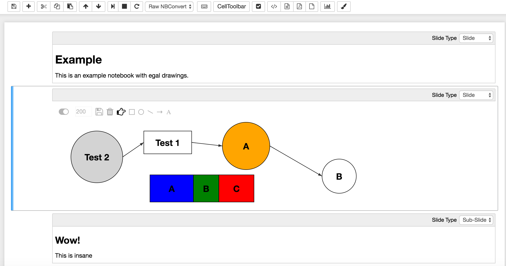
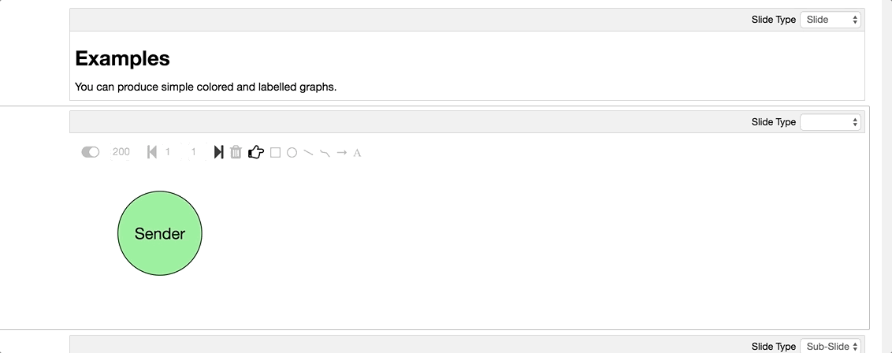

# egal
easy SVG drawing in jupyter and elsewhere...

## Example


## Instructions
Click on the "brush" icon in the jupyter toolbar to create an SVG cell below the current selection.

### Labels and Latex
To change the label of a shape, double-click on it and type. Hit enter to finish. To use **latex**, start and finish the label
with `$$` as in `$$\sum_i i$$`.

### Animation
The egal canvas shows/overlays a window of frames. This window is specified by the two numbers between the left and right arrow icons. The left number is the first frame included in the window, the right number the last frame. Each object (circles, boxes, freestyle shapes etc.) is associated with its own frame window which appears on the right when selecting the object. An object is rendered on the egal canvas when the egal frame window overlaps with the object frame window. 

Using this setup, to generate an animate build-in sequence you can:
* set the window of the first object to appear to `(1,100)`
* set the window of the second object to appear to `(2,100)`
* etc.

To click through the animation, set the egal window to `(1,1)`. Then click on the right arrow which will move the frame window to `(2,2)`, and so on. 
It will look something like this:



## Features

egal's focus is on drawing simple graphs:  

* Basic Shapes (circles, rectangles, lines)
* Freestyle Drawing
* Connectors
* Labels, with support for Latex
* Alignment hints when dragging and resizing
* Multiple Selection
* Animation (Build-in & Build-out)
* Copy & Paste

## How Does it Work?
egal creates a `raw` jupyter cell and stores the edited SVG in the source code field of that cell. 

## Installation

### Get the Python Package

Manually by cloning and changing the python path:
```bash
git clone https://github.com/uclmr/egal.git
cd egal
export PYTHONPATH=. 
```

**or** (experimental) install python package directly:
```bash
pip3 install git+https://github.com/uclmr/egal.git
```

### Install and Enable Extension
```bash
jupyter nbextension install --py egal 
jupyter nbextension enable --py egal 
```

### Optional: Server Extension 
If you want to use egal outside of a notebook you need to install the server extensions (which allows clients to 
save the SVG on the jupyter server):

```bash
jupyter serverextension enable --py egal 
```

Then you can edit an SVG on the server via accessing http://localhost:8888/files/draw.html (assuming you run
`jupyter notebook` locally).

